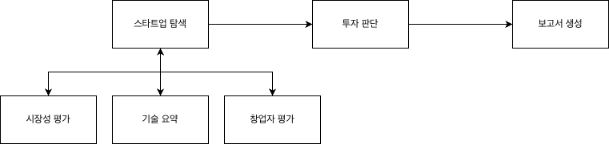

# AI Startup Investment Evaluation Agent

> 본 프로젝트는 semiconductor domain을 가진 스타트업에 대한 투자 가능성을 자동으로 평가하는 에이전트를 설계하고 구현한 실습 프로젝트입니다.

---

## Overview

| 항목 | 내용 |
|---|---|
| **Objective** | 국내 반도체 스타트업 10개사를 자동 탐색하여 기술성·시장성·창업자 역량·성공 DNA 유사도를 종합 평가하고, 투자 우선순위 보고서를 마크다운으로 자동 생성 |
| **Method** | LangGraph 기반 멀티 에이전트 파이프라인 + Agentic RAG (시장 데이터 / 성공 롤모델 DNA) + Supervisor Routing |
| **Tools** | GPT-4o (웹 탐색·평가), GPT-4o Search Preview (실시간 스타트업 정보 수집), BAAI/bge-m3 (임베딩), Qdrant (벡터 DB), pdfplumber (시장 리포트 파싱), LangGraph StateGraph (워크플로우 오케스트레이션) |

> **개발 방향성** — 개발 시간과 LLM API Rate Limit의 현실적인 제약이 있었습니다. 파이프라인의 정합성과 결과 품질을 검증하는 PoC(Proof of Concept) 차원에서 서칭하는 스타트업 풀을 10개로 제한했습니다.

---

## Features

### 과락(Pass/Fail) 필터

평가 항목은 기술성·시장성·창업자 역량 3가지이며, **단일 항목 과락이 아닌 3개 항목 합산 총점을 기준으로 1차 필터링**을 수행합니다.

창업자 역량(ex. 경력, 학벌 등)이 다소 부족하더라도 기술력과 시장성이 압도적인 기업은 여전히 투자 가치가 있을 수 있습니다. 단일 항목 기준 탈락은 이런 기업을 조기에 걸러낼 위험이 있습니다. 이 문제를 방지하기 위해 합산 총점 기준을 선택하였습니다.

### 투자 대상 산출 기준

과락을 통과한 기업들에 대해 AI가 단순히 "투자 합격/불합격"을 판정하지 않도록 구현했습니다. 투자 시장의 높은 변동성을 고려할 때, AI의 단정적 결론은 오히려 의사결정을 왜곡할 수 있다고 판단했기 때문입니다.

대신 **가중 합산 점수 기반 투자 우선순위(Ranking)를 생성**하고, 보고서 프롬프트에 리스크 섹션을 필수 항목으로 강제 지정하여 장점만큼 리스크도 충분히 서술하도록 설계했습니다. 최종 투자 결정은 보고서를 바탕으로 사람이 다각도로 판단하도록 AI를 조력자로 포지셔닝합니다.

### 성공 DNA 유사도 검사 — 반도체 산업의 특수성을 반영한 평가 지표

반도체 산업은 팹(Fab) 건설에만 수십조 원이 소요되는 구조적 특성상, 대부분의 기업이 대기업 또는 정부 주도로 시작됩니다. 순수 스타트업에서 글로벌 기업으로 성공한 사례가 극히 드문 만큼, 기술성·시장성·창업자 역량만으로는 성공 가능성을 충분히 포착하기 어렵습니다.

이를 보완하기 위해 스타트업에서 시작하여, 반도체 업계의 대표적인 성공 사례가 된 **NVIDIA·Qualcomm·AMD 3사의 데이터를 Qdrant RAG로 구성**하고, 평가 대상 스타트업의 정보와 코사인 유사도(Cosine Similarity)를 계산하여 성공 DNA를 얼마나 보유했는지를 15% 비중으로 별도 평가 항목에 반영하도록 구현했습니다.

### 조건 분기 보고서 생성

| 조건 | 보고서 유형 |
|---|---|
| 과락 통과 기업 1개 이상 존재 시 | **투자 제안서** — 투자 우선순위 랭킹 보고서 |
| 전체 과락 시 | **보류 사유서** — 서칭한 스타트업 전체의 보류 사유 및 재검토 조건 보고서 |

---

## Tech Stack

| Category | Details |
|---|---|
| **Framework** | LangGraph, LangChain, Python 3.11 |
| **LLM** | GPT-4o, GPT-4o Search Preview (OpenAI API) |
| **Vector DB** | Qdrant (Docker) |
| **Embedding** | BAAI/bge-m3 (1024-dim, 다국어 고성능 임베딩) |
| **PDF Parsing** | pdfplumber |
| **Package Manager** | uv |
| **Infrastructure** | Docker Compose (Qdrant) |

**기술 선택 근거**
- **Qdrant** — 단일 인스턴스에서 컬렉션 단위로 시장 평가 데이터(`market_eval`)와 DNA 롤모델 데이터(`dna_rolemodel`)를 격리 운영할 수 있습니다. SKALA Cloud 교육 과정에서 다뤘던 경험이 있어 선택했습니다.
- **BAAI/bge-m3** — 다양한 오픈소스 후보군과 비교했을 때, 현재 프로젝트에서는 유의미한 차이를 느끼지 못했습니다. 한/영 혼용 데이터 처리의 범용성과 기술적 레퍼런스가 풍부하다는 점에서 bge-m3를 선택했습니다.
- **GPT-4o Search Preview** — 비상장 스타트업의 실시간 정보는 정형 데이터베이스에 없는 경우가 많아 웹 검색 기반 수집이 필수적입니다. 별도 검색 툴 연동 없이 최신 정보 수집이 가능한 모델을 선택했습니다.
- **LangGraph StateGraph** — 에이전트 간 State 전달과 워크플로우 분기(보고서 분기의 로직 등)를 선언적으로 정의할 수 있어 파이프라인의 가독성과 확장성 모두를 확보하고자 선택했습니다.

---

## Agents

### 스타트업 탐색 에이전트 (Supervisor)
GPT-4o Search Preview로 조건에 맞는 실제 국내 반도체 스타트업을 실시간 웹 탐색하여 수집합니다. 하위 평가 에이전트 3종(시장성·기술성·창업자 평가)을 오케스트레이션하고, 과락 필터를 적용한 결과를 다음 단계로 전달합니다.

### 시장성 평가 에이전트
반도체 시장 PDF 리포트(PwC, KDB 등)를 Qdrant에 사전 적재하고, 각 스타트업의 도메인·목표 세그먼트와 RAG 검색 결과를 결합하여 시장성 점수(1~10)와 근거를 산출합니다.

### 기술성 평가 에이전트
스타트업의 도메인·기술 키워드를 기반으로 기술 성숙도, 특허·IP 보유 현황, 경쟁 기술 대비 차별성을 평가하여 기술력 점수(1~10)와 근거를 산출합니다.

### 창업자 종합 평가 에이전트
창업팀의 도메인 경력, 학력, 엑싯 경험, 투자 유치 현황, 트랙션(매출·고객사)을 종합하여 창업자 역량 점수(1~10)와 근거를 산출합니다.

### 투자 판단 에이전트 (DNA RAG 포함)
3개 평가 항목에 가중치(Team 35% / Market 25% / Tech 25%)를 비중에 맞게 적용하고, Qdrant에 구축된 NVIDIA·Qualcomm·AMD DNA 롤모델(기업 정보)과의 코사인 유사도를 15% 가중치로 합산하여 최종 투자 우선순위 랭킹을 생성합니다.

### 보고서 생성 에이전트
`allRejected` 플래그에 따라 투자 보고서(투자 추천 순위) 또는 반려 사유서(서칭한 스타트업 전체가 보류된 경우) 전용 System Prompt를 분기 적용하여 마크다운 보고서를 생성합니다. 투자 리스크 관련 정보를 프롬프트 레벨에서 필수 강조 항목으로 지정했습니다.

---

## Architecture

```
[Architecture Diagram Image]
```



### Supervisor 데이터 플로우 설계

Supervisor 에이전트는 스타트업 탐색 후 각 기업에 대해 시장성, 기술성, 창업자 평가 에이전트(자식 노드)를 직접 호출합니다. 각 평가 에이전트는 개별적으로 분석 결과를 Supervisor에게 다시 응답하며, Supervisor가 모든 결과를 취합·정리한 뒤 투자 판단 에이전트로 일괄 전달하는 구조입니다. 즉, 평가 에이전트들이 투자 판단 에이전트로 직접 요청을 보내는 것이 아니라, Supervisor가 모든 평가 결과를 집계하여 다음 단계로 넘기는 중앙 오케스트레이션 방식으로 설계되었습니다.

### 경쟁사 분석 에이전트 제외 이유

초기 기획 단계에서는 각 스타트업의 경쟁사를 별도 에이전트로 분석하는 파이프라인을 포함했습니다. 그러나 설계를 진행하면서 변경사항이 있었습니다.

현재 스타트업 탐색 에이전트는 동일 도메인(semiconductor) 내의 기업 10개를 동시에 수집하고, 투자 판단 에이전트는 이들을 동일한 기준으로 평가해 우선순위를 매깁니다. **동종 도메인 기업들을 같은 척도로 평가·순위화하는 것 자체가 이미 경쟁사 비교 분석의 효과를 내는 구조**라고 생각했습니다. 별도의 경쟁사 분석 에이전트는 중복 로직으로 판단하여 파이프라인 단순화와 API 호출 비용 절감을 위해 제외했습니다.

### 평가 가중치 체계

| 항목 | 가중치 | 비고 |
|---|---|---|
| 창업자 역량 (Team) | 35% | 스타트업 성패의 핵심 요소 |
| 시장성 (Market) | 25% | PDF 리포트 RAG 기반 평가 |
| 기술력 (Tech) | 25% | 특허·IP·기술 성숙도 |
| DNA 유사도 | 15% | NVIDIA·Qualcomm·AMD 등의 성공 기업과 코사인 유사도 |

---

## Directory Structure

```
rag-agent/
├── main/
│   ├── searchCorp/                     # 스타트업 탐색 및 평가 에이전트
│   │   ├── main.py                     # 파이프라인 진입점
│   │   ├── agents/
│   │   │   ├── search_agent.py         # Supervisor — 탐색 및 평가 오케스트레이션
│   │   │   ├── market_eval_agent.py    # 시장성 평가 에이전트 (RAG)
│   │   │   ├── tech_summary_agent.py   # 기술성 평가 에이전트
│   │   │   ├── startup_eval_agent.py   # 창업자 종합 평가 에이전트
│   │   │   └── rag/
│   │   │       └── market_rag.py       # BAAI/bge-m3 + Qdrant RAG 파이프라인
│   │   └── market_data/                # 시장성 평가용 PDF 리포트 보관
│   │
│   ├── investDecision/                 # 투자 판단 에이전트
│   │   └── agents/
│   │       ├── investment_decision_agent.py   # 가중치 합산 및 랭킹 생성
│   │       └── rag/
│   │           └── dna_rag.py          # NVIDIA·Qualcomm·AMD DNA 유사도 RAG
│   │
│   └── reportWriter/                   # 보고서 생성 에이전트
│       ├── graph.py                    # LangGraph StateGraph 워크플로우
│       └── agents/
│           ├── report_writer_agent.py  # 스타트업들의 과락 여부에 따른 분기 및 LLM 호출
│           └── prompts/
│               ├── case_a.py           # 투자 추천 순위 보고서 System Prompt
│               └── case_b.py           # 전체 보류 사유서 System Prompt
│
├── docker-compose.yml                  # Qdrant 컨테이너 설정
├── pyproject.toml
└── .env                                # API 키 설정 (.gitignore에 포함)
```

---

## Execution Results

```
[Result Image]
```

**실행 명령어**

```bash
# 1. Qdrant 실행
docker compose up -d

# 2. 의존성 설치
uv sync

# 3. 파이프라인 실행
python main/searchCorp/main.py
```

**출력 파일**

| 파일 | 설명 |
|---|---|
| `report_YYYY-MM-DD.md` | 최종 투자 판단 보고서 (마크다운) |
| `investment_decision_results.json` | 투자 판단 에이전트 출력 원본 |
| `analysis_results.json` | 전 에이전트 분석 결과 원본 |

---

## 투자보고서 핵심 포인트


## Lessons Learned

## 1. 프로젝트 성패에 데이터가 큰 역할을 한다.

설계 초기, State 스키마에 실제 VC들이 판단 근거로 삼는 핵심 재무 지표들을 반영하려 했습니다.

결론부터 말하면 대부분 폐기했습니다.

비상장 스타트업 특성상 재무 정보는 원칙적으로 비공개이며, 설령 일부가 언론에 노출되더라도 파편화되어 있어 신뢰할 수 있는 형태로 수집하기가 거의 불가능했습니다. 
더 당혹스러웠던 것은 기업의 설립 연도, 창업자 학력, 핵심 고객사처럼 당연히 공개되어 있을 것으로 기대한 기초 데이터조차 수집이 어려운 경우가 많았다는 점입니다. LLM은 이를 "미공개"로 처리하거나 때로는 불확실한 정보를 반환했습니다.

이 경험을 통해 느낀 점은

> **AI 에이전트의 로직과 프롬프트도 중요하지만, 에이전트가 소비할 데이터의 품질과 확보 가능성이 프로젝트의 실제 성패를 결정한다.**

입니다.

아무리 정교한 평가 모델을 설계해도, 입력 데이터가 부실하면 출력의 신뢰성은 보장되지 않습니다.
추후 프로젝트를 진행하는 과정에 있어서는 도메인에 맞춰 데이터를 먼저 수집 후, 기획을 구체화하는 방식으로 고도화하는 것을 목표로 하겠습니다.

---

## 2. 보고서 생성 에이전트에서만 StateGraph를 사용한 것에 대해서

설계 초기, 팀원 간에 전체 파이프라인을 어떤 아키텍처와 컨벤션으로 연결할지에 대한 명확한 사전 합의가 부족했습니다.

결론부터 말하면, 그 결과 전혀 다른 두 가지 구현 방식이 하나의 파이프라인 안에 혼재하게 되었습니다.

앞단의 `searchCorp`, `investDecision` 에이전트는 팀원들이 각자 익숙한 방식에 따라 순수 Python 함수 호출과 `_send_to_next_stage` 패턴으로 먼저 구현했습니다. 반면, 이후에 합류한 보고서 생성 에이전트 단계에서는 새로운 노드를 추가하면서 LangGraph의 StateGraph를 도입했습니다. 

마지막 노드라는 위치 덕분에 `report_graph.invoke()`로 독립적인 호출과 테스트가 가능했고, 추후 Case A/B 분기도 `add_edge`로 쉽게 확장할 수 있는 구조를 열어두었다는 점은 긍정적이었습니다. 하지만 전체 시스템 관점에서는 순수 함수 흐름에서 갑자기 그래프 아키텍처로 넘어가는 다소 어색한 구조가 되었습니다. 이로 인해 기존의 `_send_to_next_stage` 함수 안에서 `sys.path`를 조작하여 강제로 그래프를 호출하는 불안정한 연결부가 생기고 말았습니다.

이 경험을 통해 느낀 점은

> **개별 모듈의 완성도만큼이나 전체 파이프라인을 관통하는 기술 선택의 일관성이 중요하다.**
> 전체를 StateGraph로 통합하든, 전체를 순수 함수로 통일하든 — 사전에 합의되지 않은 방식의 혼재는 필연적으로 기술 부채와 복잡성을 남긴다.

입니다.

처음부터 파이프라인 전체를 하나의 아키텍처로 설계했다면 노드 간 연결이 선언적으로 명확해지고, `sys.path` 조작 같은 우회로도 필요 없었을 것입니다. 추후 고도화 시에는 전체 파이프라인을 단일 LangGraph 워크플로우로 재설계하여 통일성을 맞추는 것을 목표로 하겠습니다.

---

## 3. 병렬 처리의 성패는 올바른 자원 관리에 달려있다.

설계 초기, 에이전트의 작업 처리 속도를 극대화하기 위해 Supervisor 패턴을 활용한 Graph 아키텍처 기반의 병렬 처리를 기획하고 구축했습니다.

결론부터 말하면 이 병렬 처리 구조는 메모리 이슈로 인해 실패했습니다.

빠른 처리를 위해 여러 작업이 동시에 수행되도록 구성했지만, 정작 뼈대가 되는 RAG 파이프라인에 싱글톤(Singleton) 패턴이 적용되어 있지 않았던 것이 화근이었습니다. 병렬로 실행되는 노드들이 끊임없이 새로운 RAG 객체를 생성하고 무거운 데이터를 메모리에 중복해서 적재하다 보니, 결국 시스템이 버티지 못하고 한계에 부딪혔습니다. 현재는 어떻게든 안정적인 동작을 보장하기 위해 병렬 처리를 걷어내고 순차 진행(Sequential) 방식으로 우회하여 가동하고 있습니다.

이 경험을 통해 느낀 점은

> **아무리 우수한 동시성 아키텍처를 도입하더라도, 그 내부에서 동작하는 핵심 모듈의 메모리 관리와 객체 생명주기가 최적화되어 있지 않으면 시스템은 붕괴한다.**

입니다.

화려하고 빠른 아키텍처를 그리는 것만큼이나, 단일 컴포넌트가 시스템 자원을 어떻게 소비하는지 꼼꼼하게 점검하는 것이 필수적입니다.
추후 프로젝트를 고도화하는 과정에서는 RAG를 비롯한 무거운 객체들의 생명주기를 싱글톤으로 엄격히 관리하여 자원 누수를 차단하고, 메모리 프로파일링을 거친 후 다시 안전하게 병렬 처리 아키텍처로 전환하는 것을 목표로 하겠습니다.

---

## Contributors

| 이름 | 담당 |
|---|---|
| **배민준** | 스타트업 탐색 에이전트, 시장성 평가 에이전트, 기술성 평가 에이전트 개발 (Supervisor) |
| **서지윤** | 보고서 생성 에이전트 개발 |
| **한준교** | 투자 판단 에이전트 개발 |